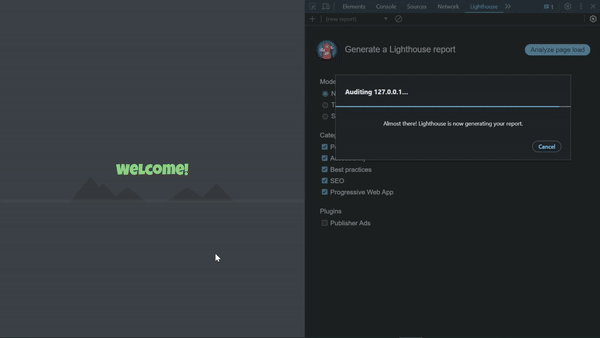
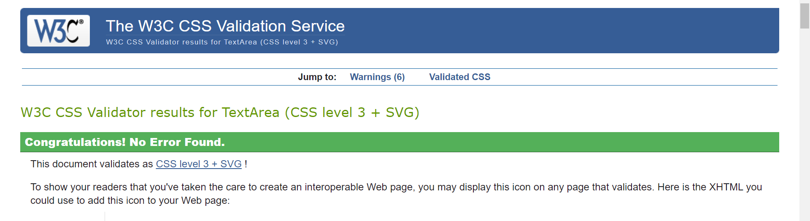

<link rel="stylesheet" type="text/css" media="all" href="assets/css/readme.css" />

# Poke the bear!

## TIP!

If you want to view this document with more intricate styling, you can clone this project and preview it in your code editor eg. VS Code.  

## Introduction

This is a simple JavaScript game inspired by the famous expression 
'Poke the bear!'. 
The game is an attempt to solve the 'real-world problem' of drawing a random person out of a group but in a more 
fun
and 
creative
way. 

To exemplify this, imagine a family whose children want to sit in the front seat of the car. One could easily bring up 
'Poke the bear!'
on their phone or computer to randomly choose one lucky winner. The one who survives the bear encounter gets to sit in the front seat of the car. 

Since the winner is chosen randomly, a larger range of people can take part in the draw without the sensation of unfairness. Allowing children to have a chance against adults, as well as people with different kinds of disabilities, etc.

Click [here](https://kevinbjarnemark.github.io/poke-the-bear/) to visit the deployed version of this website.

#### Definition
**Poke the bear** - To deliberately provoke or antagonize a person or group, esp. one that is dangerous or powerful. 
[Source](https://www.oed.com/dictionary/bear_n1?tab=meaning_and_use#1266599020)

## Rules/instructions

Again, to widen the 'range' of users, the game is very simple. Users can easily add their usernames to the landing page and enter the gaming realm. Inside the game, the quest is to take turns in poking the bear. For ultimate 'unpredictability', the hint message will **randomly** pick whose turn it is.

As the players keep poking, the bear's furious rage will progressively increase. Eventually, someone will be kicked out of the game. This will reset the rage meter and allow the others to continue. The 'last standing' player that survived the hair-raising bear encounter takes the price.

## Features

#### Landing page/start menu

    

        Add players
    

The start menu enables the users to add their names to the player's list. This personalizes the game experience by sending 'custom-created' users into the game space. 

To prevent user inputs from destroying the interface, among other things, certain criteria must be met for the players to gain access to the game space. The users are constrained to follow these criteria for the following reasons:
1. To avoid breaking the underlying game logic.
2. To avoid breaking the UI with 'lengthy' usernames, or usernames without characters.
3. To avoid players choosing identical usernames.
4. To limit the amount of players entering a game.

- Minimum amount of players: 2
- Maximum amount of players: 150

    

        Remove players
    

A player removal system has been implemented to enhance the user experience. It addresses real-world scenarios such as when a user mistakenly adds an incorrectly typed username to the player list, or when a registered player needs to leave before the game starts. Users can simply click the red 
X
button to remove a player from the list.

## Future implementations

Here's a breakdown of some ideas and improvements to further develop this project.

    

        Settings
    

At the landing page/start menu and perhaps accessible inside the game, a 'settings area' should be considered to both solve problems and to enhance the user experience. Here's a breakdown of some of the settings that could be implemented. 

##### **Temperament meter** 

- A setting that sets how easily the bear will be provoked.

This could make it easier to speed up a game if it is a large group who is playing.

    

        Ideas
    

Right now, the game is very limited in terms of possibilities. More features could easily be implemented to further increase the excitment when playing this game. Here's a list of some ideas.

#### **Spinning wheel** 

instead of just a poke button, a spinning wheel could be introduced. This wheel would randomly pick between a set of buttons. Here's some ideas for buttons to implement:

- **Petting button**

A button that lets the user pet the bear, this would decrease the rage meter.

- **Lazer pointer button**

This would definitely increase the rage meter

- **Salmon button**

Give the bear a salmon! This would bring the rage down to 0.

    

        More
    

1. Delete all players button
2. Rules pop-up at the game menu
3. See who won in the previous game indicated by a star or similar
4. Scoreboard

## Credits and resources

### Fonts

The fonts below were found at [Google fonts](https://fonts.google.com/).

- [Tilt Neon](https://fonts.google.com/specimen/Tilt+Neon)
- [Luckiest Guy](https://fonts.google.com/specimen/Luckiest+Guy)
- [Niramit](https://fonts.google.com/specimen/Tilt+Neon)

### Art & design (images, icons, etc.)

All images, icons, logos, etc., have been designed, illustrated, and drawn by the creator of this GitHub repository, Kevin Bjarnemark. I'm that person, so I'll describe myself in the first person in this chapter.

I've never drawn a bear before, and I'm quite out of practice since I mostly write code these days. Obviously, the bear in this project isn't a professional design. However, after working in public schools, I've noticed that children generally tend to prefer designs that are 'unprofessional'.

The bear is drawn from imagination, although I did a quick Google search beforehand to refresh my memory of bear anatomy. Initially, I tried to draw the bear realistically, but later I felt that it didn't fully represent my vision. I also wanted to make the game inclusive for everyone, so I decided to sketch a more child-friendly version with soft paws.

#### illustration (version 1)

#### Hand-drawn sketch (version 2)

#### Illustration (version 2)

## Testing 

Here's the tools used to test this project against performance issues, accessibility, best practices, seo, and so forth.

- [Lighthouse](https://chromewebstore.google.com/detail/lighthouse/blipmdconlkpinefehnmjammfjpmpbjk)
- [W3C validator](https://validator.w3.org/)
- [Jigsaw validator](https://jigsaw.w3.org/css-validator/)
- [JsHint](https://jshint.com/)

The tests below have been run locally and may not be as favorable when testing the deployed site (with the extension tool). 

## Deployment

This project was deployed through [GitHub](https://github.com/) pages. It is a service that simplifies the deployment by automatically deploying whenever you push changes to your GitHub project.
- Select the default branch (main) (in the settings).
- Wait for GitHub to build your project.
- Done! 

## Code
In this section, I will go over some concepts reflected in the actual codebase of this project. 

#### Maintainability & optimization

This project has been built with maintainability in mind. In this chapter, we'll briefly review some workflows that align well with the current structure of the project. Code references are listed at the end. 

##### CSS variables

If the developer wants to change the color of a specific asset (or group of assets), minimal work should be required. The color should be set at the top of the CSS document without the hassle of searching through multiple locations to change a single color. This also optimizes performance since the browser has less data to handle. For instance, the browser can choose between three grays instead of a multitude of different shades."

##### Globally available functions

Functions that the developer may need to access in the future should be easily available for future use. Nested functions should be carefully considered, as the developer might want to run a function from a different angle (e.g., settings menu, API, etc.). This process should be simple, requiring minimal work to access the desired functionality.

#### Code references

##### #1 Global scope

The global scope consists of key variables and elements that many functions need to access. For a small project like this, it's an effective way to manage state globally. However, as the project grows, it may be beneficial to switch to a state management library like React for more efficient state handling. In this way, individual entries in an object can reference specific variables, allowing the developer to pass single entries or 'props' as parameters to functions. If the project continues in vanilla JavaScript, objects that need global references can be split into smaller groups. This prevents smaller functions from handling unnecessary data.
